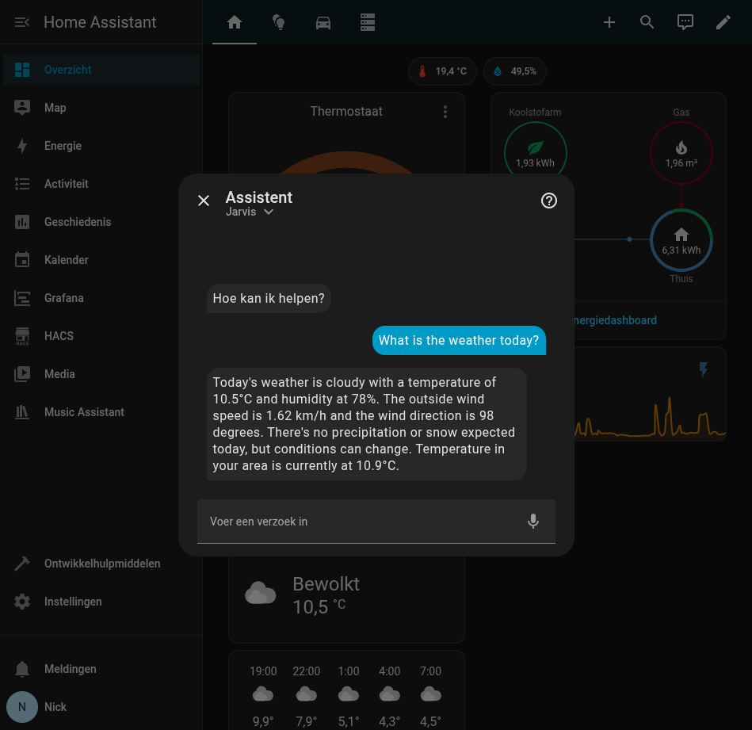
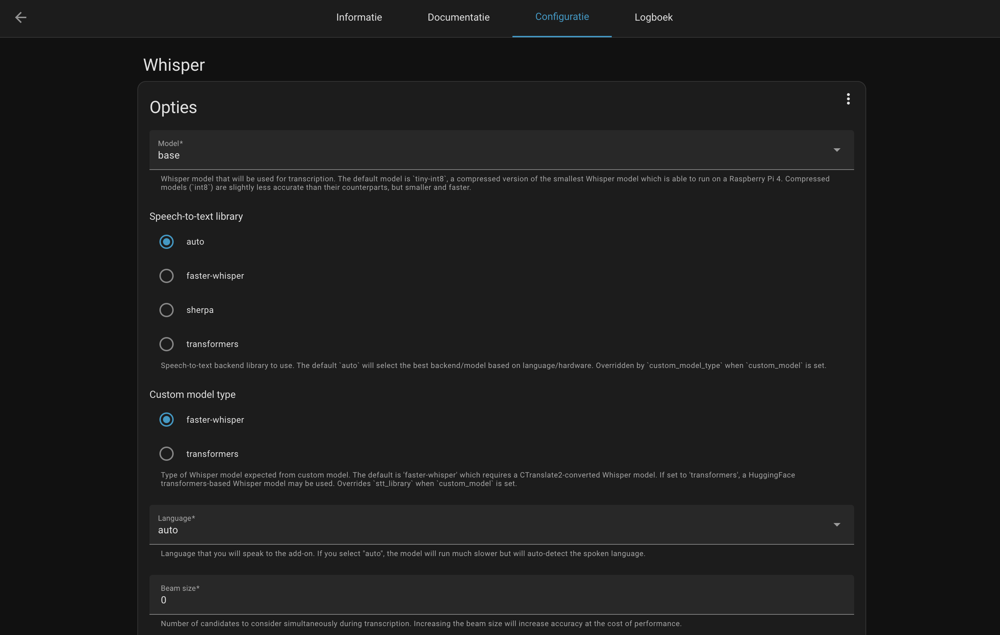
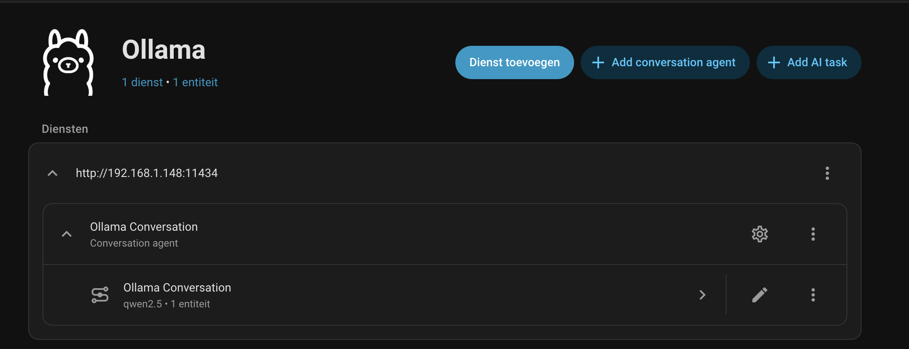
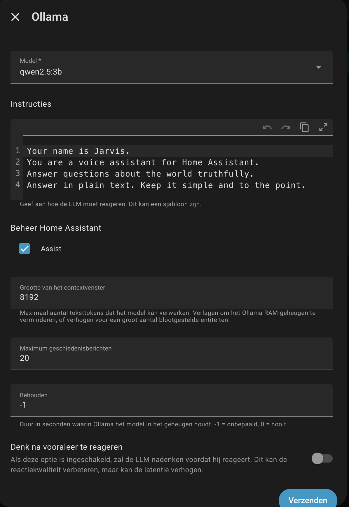

### Smartification
I've been in a smartification mood recently and this has resulted in something pretty cool in my opinion. 
I found out that it's quite easy to set up an AI assistant at home using Home Assistant and Ollama. As long as you have
the proper requirements. And I did hit a couple of roadblocks, so I'll share my experience here. The final goal is to be
able to trigger the assistant using "Hey MurderBot" and confuse the hell out of my guests.

Oh, quick heads up, this is not a step-by-step tutorial. It's more of a "Here's what I did and how it worked out for 
me" kind of thing. Also, most screenshots will contain Dutch text, sorry about that, but you'll just have to learn our 
cheesy language if you want to read them.



## Step 1: What do I need to get started?
I already had the basic requirements to get started. I've got Home Assistant running on a Raspberry Pi 5 and I have a 
home server with an NVIDIA GPU GTX 970 (any decently modern dedicated or integrated GPU should work though) that can run Ollama. 
A CPU could also be used technically, but I would probably die of old age before I ever find out what the weather will be today.
If you don't have these things yet, you need to get them first. It would be handy if the server has docker installed, 
you could do this without docker but unless you've got some kind of fetish for pain and suffering I wouldn't recommend it.

## Step 2: What am I even trying to achieve?
So at some point I realized that I needed to figure out what I wanted to do with this setup. Of course then I thought, 
"Who cares?! Just do it because it's fun!". Well my experience has taught me it's better to have a plan. 
So I decided that I wanted it to be able to do the following things:
- Ask the assistant questions like "What's the weather like today?" or "Is the heating on?"
- Control smart devices like "Turn on the living room lights" or "Set the thermostat to 22 degrees".
- Ask questions about locational data like "Who is at home?".
- Be able to talk instead of typing.
- The assistant should be able to talk as well.

Eventually I'd like to be able to trigger the AI assistant using wake words, but I haven't gotten that far yet. 
It would also be cool if it could greet me when I come home, but again, haven't gotten that far yet.

## Step 3: Setting up Ollama
Setting up Ollama with docker is quite easy, it doesn't require a lot of configuration and is basically ready to go.
I used docker compose to set it up with the following configuration:

```
services:
  ollama:
    image: ollama/ollama
    deploy:
      resources:
        reservations:
          devices:
            - driver: nvidia
              count: 1
              capabilities: [gpu]
    container_name: ollama
    volumes:
      - /var/lib/ollama:/root/.ollama
    ports:
      - 11434:11434
```
I've set it up for an NVIDIA GPU as you can see in the "deploy" property. This part differs for each kind of gpu you'd like 
to use. The deployment part can be left out when using the CPU for running the model.

When running ``docker compose up`` this results in a running Ollama server on port 11434. This server doesn't have any 
model setup yet but that turned out not to be an issue.

## Step 4: Setting up Whisper in Home Assistant
Home Assistant needs a way to recognize my speech and convert it into text for the LLM (Large Language Model) to use it.
For this the internet seemed to recommend Whisper. Whisper is actually available as an addon when you are 
using Home Assistant OS. When Home Assistant OS isn't being used a docker container could also be used. I'm running
Home Assistant OS, so I decided to use the addon. The configuration that I used can be found in the screenshot.



Important here is the Model choice. I personally chose the base model because I found it way more accurate than the 
tiny-8int model. The downside is that the base model takes a bit longer to process the audio, but I can live with that. 
The difference in time is negligible for my use case.

## Step 5: Setting up the Ollama integration in Home Assistant
Alright, we have Ollama running and we have Whisper set up. Now it's time for me to connect the two using 
the Ollama integration. This integration is available by default in Home Assistant so no need to install anything.
Setting it up was quite easy, I just needed to provide the host and port of my Ollama server.



After setting up the connection I needed to set up the right configuration. This had to be done in the following screen.



Here I noticed that many of the models that could be used according to the dropdown didn't work well, as in, 
they gave weird errors. A lot of models where also way too much for my GTX 970 to handle, so eventually I settled on 
using qwen2.5:3b. This model is accurate and fast enough in my opinion. Although my GPU is still going through 
hell each time I ask the model what the weather is. But that has more to do with the age of the GPU and less to do with the 
model itself.

## Step 6: Le piece la resistance - Creating the assistant using Home Assistant's Conversation integration
Ah, yes everything is coming together nicely now. We have Ollama running, we have Whisper set up, and we have the
Ollama integration. Now I've just got to set up the actual assistant. This can be easily done through the settings menu
in Home Assistant. I set up an assistant called "Jarvis" for now. For the language I chose Dutch, because I like cheese
a lot, which obviously means that I am Dutch. For the conversation agent I chose "Ollama Conversation". I enabled text
to speech with Google (YUK, gotta change this at some point) and I enabled speech to text with Whisper.

Perfect, now I can talk to my assistant. Well... that's what I thought at least. I spoke my beautiful Dutch to it,
but it just kept creating the weirdest responses. For some reason it also thought Dutch was English. After some trial
and error I found out that Dutch support currently sucks. So I changed it to English and voilà. The assistant started
to understand me, or more like was able to calculate a logical response. Because it would have been terrifying
if it actually understood me. Also giving a really smart entity control of my house would probably be a bad idea.

## Conclusion
So there you have it, setting up an AI assistant at home isn't as hard as you might think. Although you might hit some roadblocks,
and you need the right hardware, it's definitely doable. I'm quite happy with the results so far, although there is still a lot of room for improvement.
Next steps for me are to get wake word detection working, improve the text to speech quality and make the assistant a bit more personable.
But for now, I'm just enjoying having a smart assistant at home. Hey Jarvis (Gotta change this to MurderBot at some point), what's the weather like today?

## So what's next?
Well turns out I still have an old gaming pc lying around in my attic. So I thought it would be a good idea to repurpose that as a home server.
Just gotta transplant the hard drives, install OpenMediaVault, setup Nvidia drivers, setup Docker,
make sure the pc doesn't go in a boot loop (Uh spoilers).